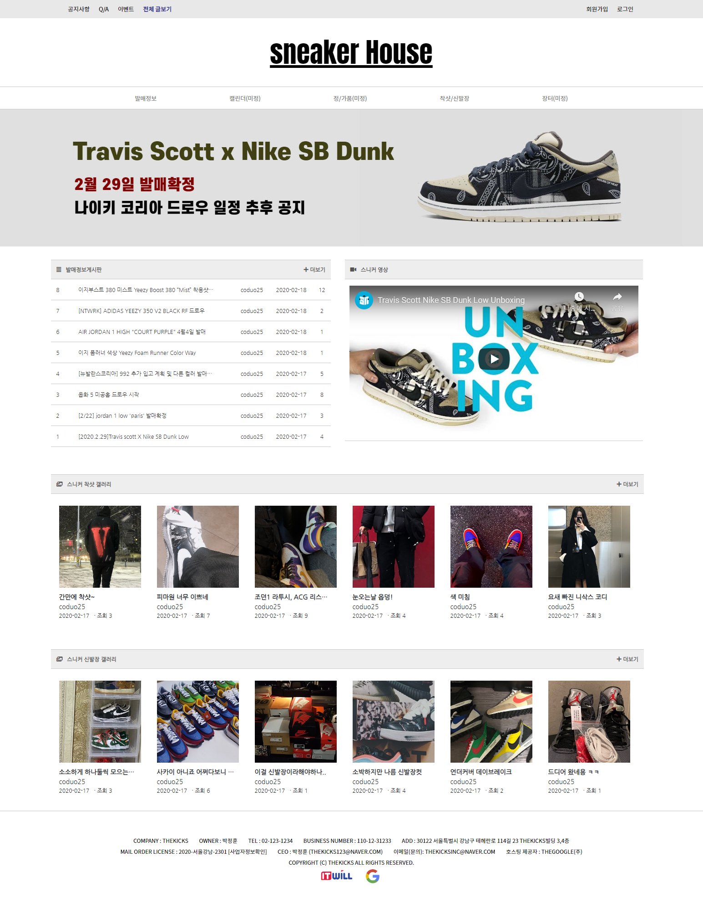
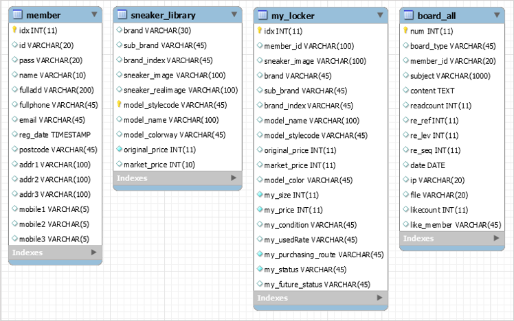
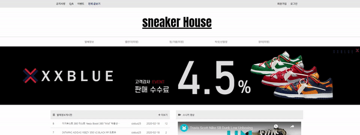
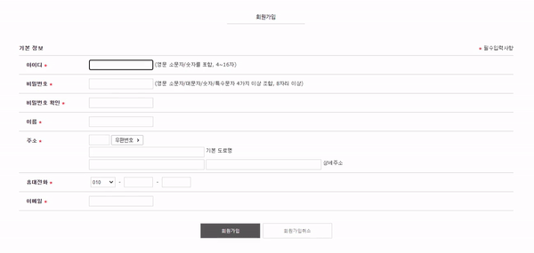

# SneakerHead Project / 2020.01 - 2020.02

 Main Page Preview 

  

 

## 주제
> **프리미엄 신발 관련 커뮤니티 웹 서비스**

## 개발환경

* 개발도구
  * Eclipse Neon 3 v4.6.3
  * MySQL WorkBench v8.0.17
   
* 언어
  * JAVA SE1.8 (JDK 8)
  * JSP (model 1)
  * MySQL
  * HTML5/CSS3
  * JavaScript/Jquery
   
* 서버(WAS)
  * Apache Tomcat v8.5
   
* 커뮤니티
  * Google Document / Github

## 개요

### SneakerHouse 소개
프리미엄 신발 관련 발매 정보, 착샷 게시판 등 커뮤니케이션을 하기 위한 웹 서비스

### 선정이유
현재 운영중인 신발 관련 커뮤니티에서 밴치마킹을 통해 고쳐야할 부분은 개선하고 더 깔끔한 디자인의 커뮤니티를 만들기 위함

### 주요기능
* 발매 정보 게시판
* 착샷/신발장/셀럽들 이미지 게시판
* 나의 신발장 관리 게시판
* 관리자/일반 사용자 글쓰기/수정 기능

## DB 구성 - ER Diagram

  

 

## 기능구현

### 메인 페이지 배너
* 자바스크립트로 Slide 함수를 만들어 직접 제작한 3가지 종류의 이미지를 넣어서 만듬.
* 이미지 클릭시, 해당 페이지로 갈수 있도록 링크 걸어둠.
> 

 

### 회원가입
* jQuery를 활용하여 아이디, 비밀번호, 비밀번호 확인, 이메일란 유효성 검사하기.
* 유효성 검사를 하는 동시에 Ajax를 활용한 아이디 및 이메일 중복 확인 검사하기.
> 

 

### 게시판
* 모든 게시판, 글 상단부에 최근 공지사항 글 5개를 DB에서 가지고 와서 뿌려줌.

